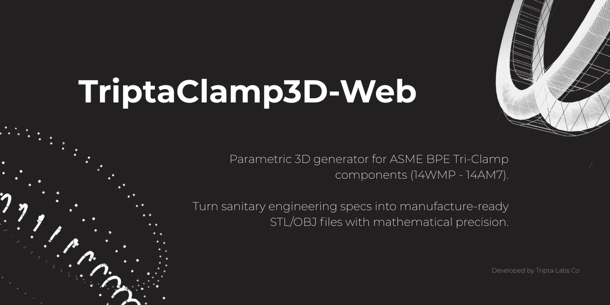

<p align="center">
  
</p>

<br />

**Tripta Fittings** es un visor web para explorar geometrías **Tri-Clamp** y **gaskets** con parámetros inspirados en **ASME BPE**. El modelo se genera por **revolución** de un perfil 2D y se visualiza en **Three.js**: puedes alternar entre bordes, malla, nube de puntos y sólido, ajustar el color de la vista técnica y **exportar** la malla a **STL** (binario o ASCII) u **OBJ**.

En la raíz, `index.html` usa un **`importmap`** para cargar **Three.js** desde CDN (no hace falta compilar para probarlo así). El código de la app está en **`src/`**; también puedes usar **Vite** (ver abajo) para desarrollo con recarga y build de producción.

---

### Estructura del repositorio

| Ruta | Contenido |
|------|-----------|
| `index.html` | Entrada: fuentes, `importmap`, enlace a CSS y a `src/main.js`. |
| `src/main.js` | Lógica del visor: escena Three.js, presets, geometría, exportación. |
| `src/styles.css` | Estilos del panel y del layout. |
| `src/presets.csv` | Tabla de presets normativos (una fila por tamaño). Es la fuente de verdad; el build copia el CSV a `dist/` para el despliegue. |
| `vite.config.js` | Configuración de Vite y copia de `presets.csv` al generar `dist/`. |
| `banner.png` | Imagen del encabezado de este README. |

---

### Qué incluye la app

- Presets por tamaño (y longitudes corta/larga tipo norma) para férula y empaque.
- Panel lateral responsivo: en pantallas pequeñas se colapsa para dejar sitio al lienzo 3D.
- Cámara orbital sobre el modelo y descarga de malla según la geometría actual.
- Modo **Custom** para editar parámetros con sliders cuando no usas un preset del CSV.

---

### Cómo abrirlo (sin instalar dependencias)

Necesitas un navegador con **WebGL** y **módulos ES**.

Abre **`index.html`** desde la raíz del clon (doble clic o arrastrando al navegador). Debe existir la carpeta **`src/`** junto a ese archivo.

Si abres el archivo con `file://`, en algunos navegadores **no se puede leer** `presets.csv` por política de seguridad; entonces se usan los valores de respaldo embebidos en `main.js`. Para cargar siempre el CSV del proyecto, sirve la carpeta con HTTP:

`pnpm dlx serve .`

y abre la URL que indique la herramienta (por ejemplo `http://localhost:3000`).

---

### Desarrollo con pnpm

Si clonas el repo y quieres **Vite** (recarga al guardar, build optimizado):

```bash
pnpm install
pnpm dev
```

- **`pnpm dev`** — servidor de desarrollo (resuelve `three` desde `node_modules` y sirve `src/`).
- **`pnpm build`** — genera **`dist/`** (HTML, JS y CSS empaquetados; **`presets.csv`** se copia a la raíz de `dist/` para que la carga de presets siga funcionando).
- **`pnpm preview`** — sirve localmente la carpeta `dist/` para comprobar el resultado del build.

---

### Stack

**Three.js** (OrbitControls, exportadores STL/OBJ, `LatheGeometry`) · **CSS** (Inter, Fira Code) · **CSV** para presets · **Vite** opcional para dev y producción

---

### Licencia

[Código abierto bajo la licencia MIT](LICENSE).

---

**TriptaLabs**
